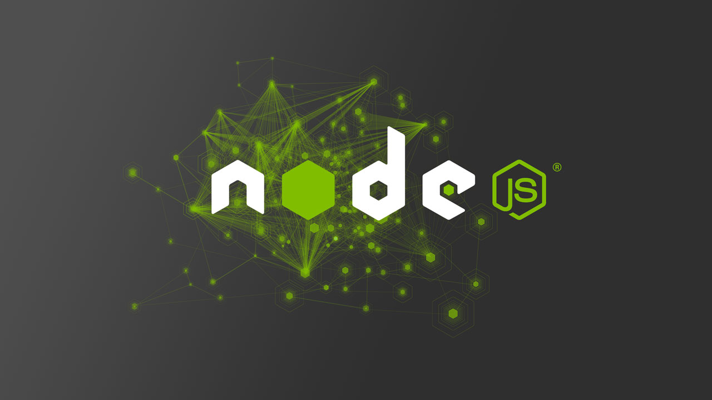

<h1 align="center">Node.JS</h1>

## Sumário
- [Introdução](#introdução-ao-repositório-timerun-e-o-mundo-assíncrono-do-nodejs)
- [História do Node.Js](#a-história-do-nodejs-da-ideia-inovadora-ao-ecossistema-poderoso)
- [Quem é Ryahn Dahl?](#quem-é-ryan-dahl-o-visionário-por-trás-do-nodejs)
- [Como Instalar e Utilizar o Node.js](#como-instalar-e-utilizar-o-nodejs)
- [Como Funciona o package.json no Node.js](#como-funciona-o-packagejson-no-nodejs)

---
## Introdução ao Repositório: Timerun e o Mundo Assíncrono do Node.js

Bem-vindo ao repositório dedicado ao estudo aprofundado do **timerun** no Node.js. Este projeto visa desmistificar e explorar os mecanismos internos que governam o agendamento e a execução de tarefas assíncronas no ambiente Node.js, um aspecto fundamental para qualquer desenvolvedor que busca criar aplicações eficientes, escaláveis e responsivas.

O **Node.js** emergiu como uma das plataformas mais poderosas para o desenvolvimento de aplicações backend, microsserviços e sistemas em tempo real, graças à sua arquitetura baseada em **JavaScript** e um modelo de I/O **não bloqueante e orientado a eventos**. Essa abordagem, embora extremamente vantajosa para lidar com alta concorrência, traz consigo a necessidade de um entendimento profundo sobre como o Node.js gerencia o fluxo de execução, especialmente quando se trata de operações que levam tempo para serem concluídas – como requisições de rede, acesso a bancos de dados ou, no nosso caso, **timers**.

No cerne dessa gestão assíncrona está o **Event Loop**, um mecanismo crucial que permite ao Node.js lidar com múltiplas operações simultaneamente sem a necessidade de criar um _thread_ separado para cada uma. Dentro desse Event Loop, os timers (como `setTimeout` e `setInterval`) desempenham um papel vital, agendando funções para serem executadas em um momento futuro. Compreender o **timerun** significa mergulhar nas fases do Event Loop, nas filas de _callbacks_ e na prioridade de execução, desvendando como seu código assíncrono realmente se comporta.

Através deste repositório, você terá a oportunidade de explorar exemplos práticos, diagramas explicativos e análises de código que ilustram o funcionamento do timerun, capacitando-o a escrever código mais robusto, prever o comportamento de suas aplicações e otimizar a performance. Prepare-se para desvendar os segredos por trás da magia assíncrona do Node.js!

[Voltar ao topo](#sumário)

---

## A História do Node.js: Da Ideia Inovadora ao Ecossistema Poderoso

O Node.js, hoje uma ferramenta indispensável no desenvolvimento web, tem uma história relativamente recente, mas repleta de inovações que mudaram a forma como construímos aplicações. Sua jornada começou com uma ideia ousada de [Ryan Dahl](#quem-é-ryan-dahl-o-visionário-por-trás-do-nodejs) em **2009**, que buscava solucionar um problema fundamental: a ineficiência dos servidores web tradicionais em lidar com múltiplas conexões simultâneas.

 ### O Nascimento da Ideia (2009)
 
 Ryan Dahl, insatisfeito com as limitações dos servidores Apache e Nginx para aplicações com alto volume de E/S (entrada/saída), como chats em tempo real e streaming, teve uma epifania. Ele percebeu que o modelo de I/O bloqueante (onde o servidor espera a conclusão de uma operação antes de iniciar a próxima) era o gargalo. A solução? Um ambiente de execução JavaScript no lado do servidor que utilizasse um modelo de I/O não bloqueante e orientado a eventos.

Para isso, Dahl escolheu o motor V8 do Google Chrome, conhecido por sua velocidade e eficiência na execução de JavaScript. Em 2009, ele apresentou o projeto Node.js na conferência JSConf EU. O nome "Node" foi escolhido para refletir a ideia de que cada conexão é um "nó" no grafo de eventos, processado de forma assíncrona.

### Primeiros Anos e Crescimento (2010-2012)
Nos anos seguintes, o Node.js começou a ganhar tração. A comunidade de desenvolvedores abraçou a novidade, atraída pela promessa de construir aplicações escaláveis e de alta performance com uma única linguagem (JavaScript) tanto no frontend quanto no backend.

- **NPM (Node Package Manager) - 2010**: Uma das maiores contribuições para o ecossistema Node.js foi o lançamento do NPM por Isaac Schlueter. O NPM revolucionou a forma como os desenvolvedores compartilhavam e gerenciavam pacotes (bibliotecas e módulos), tornando o desenvolvimento muito mais rápido e eficiente. Ele se tornou rapidamente o maior repositório de software do mundo.

- **Adoção por Grandes Empresas**: Empresas como LinkedIn, Netflix e Uber começaram a experimentar e, posteriormente, adotar o Node.js em suas arquiteturas, comprovando sua robustez e escalabilidade em cenários de produção.

### Desafios e Maturidade (2014-2015)

Apesar do rápido crescimento, o Node.js enfrentou alguns desafios, principalmente relacionados à sua governança e à velocidade de lançamento de novas versões.

- **A cisão io.js (2014)**: Em 2014, um grupo de desenvolvedores insatisfeitos com a forma como a Joyent (empresa que inicialmente patrocinava o Node.js) estava gerenciando o projeto, decidiu criar um "fork" chamado **io.js**. O io.js visava acelerar o desenvolvimento, incorporar novas funcionalidades do ES6 (ECMAScript 2015) mais rapidamente e ter uma governança mais aberta.

- **A união e a Node.js Foundation (2015)**: Felizmente, a comunidade percebeu que a fragmentação não era o melhor caminho. Em 2015, os projetos Node.js e io.js se uniram novamente sob a égide da Node.js Foundation (hoje parte da OpenJS Foundation). Essa união marcou um ponto de virada, estabelecendo um modelo de governança mais transparente e colaborativo, garantindo a longevidade e o desenvolvimento contínuo do Node.js.

### O Node.js na Atualidade (2016 em diante)

Desde então, o Node.js solidificou sua posição como uma das tecnologias mais populares para o desenvolvimento backend, APIs, microsserviços, aplicações em tempo real e muito mais.

- **Versões LTS (Long Term Support)**: A adoção de versões LTS garante estabilidade e suporte a longo prazo para empresas e projetos maiores.

- **Ecossistema Vibrante**: O NPM continua a crescer exponencialmente, com milhões de pacotes disponíveis, cobrindo praticamente todas as necessidades de desenvolvimento. Frameworks como Express.js, NestJS e Next.js simplificaram ainda mais a criação de aplicações complexas.

- **Serverless e Edge Computing**: O Node.js se tornou uma escolha popular para funções serverless em plataformas como AWS Lambda e Google Cloud Functions, bem como para aplicações de edge computing, devido à sua leveza e rapidez.

---

A história do Node.js é um testemunho do poder da inovação, da colaboração da comunidade e da capacidade de se adaptar e evoluir. De uma ideia singular para solucionar um problema de I/O, ele se transformou em um pilar fundamental da internet moderna, impulsionando desde pequenas aplicações até os maiores sistemas distribuídos do mundo.

[Voltar ao topo](#sumário)

---

## Quem é Ryan Dahl? O Visionário Por Trás do Node.js

Por trás de toda grande inovação, há uma mente criativa, e no caso do **Node.js**, essa mente pertence a **Ryan Dahl**. Nascido em 1981, Dahl é um engenheiro de software americano que se tornou uma figura proeminente no universo do desenvolvimento web por suas contribuições revolucionárias.

Sua jornada não começou diretamente com o Node.js. Antes de mergulhar no mundo do JavaScript e do desenvolvimento de servidores, Dahl estudou **matemática** em universidades como a Universidade da Califórnia em San Diego e a Universidade de Rochester. Ele chegou a cursar um doutorado, mas acabou desistindo, buscando uma aplicação mais prática para seus conhecimentos. Foi nesse período que ele se aventurou no desenvolvimento de aplicações web usando **Ruby**.

A grande virada aconteceu em **2009**. Ryan Dahl, frustrado com a forma como os servidores web tradicionais lidavam com operações de entrada e saída (I/O) de forma bloqueante – o que significava que um servidor precisava esperar uma operação ser concluída antes de iniciar a próxima – começou a buscar uma alternativa. Ele vislumbrava um ambiente onde as operações pudessem ser executadas de maneira **assíncrona e não bloqueante**, permitindo que o servidor processasse muito mais conexões simultaneamente sem gargalos.

A solução que ele idealizou combinava o motor **V8 do Google Chrome** (que executa JavaScript de forma extremamente rápida) com um modelo de I/O orientado a eventos. O resultado foi o **Node.js**, lançado oficialmente em 27 de maio de 2009. Sua visão era permitir que desenvolvedores construíssem aplicações de rede escaláveis utilizando a mesma linguagem (JavaScript) tanto no frontend quanto no backend, simplificando o processo e tornando-o mais eficiente.

Após dedicar-se intensamente ao Node.js por alguns anos, Dahl anunciou em 2012 que se afastaria do desenvolvimento diário do projeto, passando a gestão operacional para Isaac Schlueter, criador do NPM (Node Package Manager). Sua motivação era explorar novos projetos de pesquisa e desenvolvimento.

Anos depois, em 2018, Ryan Dahl apresentou outro runtime JavaScript/TypeScript: o Deno. Criado com a intenção de corrigir algumas das "decepções" que ele tinha com o Node.js original, o Deno oferece um ambiente com foco maior em segurança e modularidade, utilizando Rust em sua base e suportando TypeScript nativamente.

Hoje, Ryan Dahl continua ativo na comunidade de desenvolvimento, sendo CEO da Deno Land Inc. Ele é reconhecido como um pensador inovador que não tem medo de desafiar o status quo e repensar fundamentalmente como as aplicações são construídas. Sua influência no cenário da programação é inegável, tendo moldado significativamente o caminho do desenvolvimento web moderno.

[Voltar ao topo](#sumário)

---

## Como Instalar e Utilizar o Node.js

Agora que já exploramos a história, os conceitos fundamentais e o visionário por trás do Node.js, é hora de colocar a mão na massa! Para começar a desvendar o timerun e construir suas próprias aplicações assíncronas, o primeiro passo é instalar o Node.js em sua máquina.

A instalação do Node.js é um processo simples e direto, e existem algumas maneiras recomendadas para garantir que você tenha a versão correta e possa gerenciá-la eficientemente.

### Escolhendo a Versão do Node.js
Antes de instalar, é importante saber que o Node.js segue um ciclo de lançamento que inclui versões LTS (Long Term Support) e versões Current (mais recentes):

* LTS (Long Term Support): São versões estáveis, testadas e recomendadas para a maioria dos ambientes de produção. Elas recebem suporte e atualizações por um período mais longo, garantindo maior estabilidade e menos surpresas. Para a maioria dos projetos, especialmente se você está começando, esta é a versão altamente recomendada.

* Current: Contêm os recursos mais recentes e as últimas melhorias. São ótimas para experimentar novas funcionalidades, mas podem não ser tão estáveis quanto as versões LTS e têm um ciclo de vida mais curto.

Sempre que possível, opte pela versão LTS, a menos que você tenha uma necessidade específica para os recursos da versão Current.

### Métodos de Instalação
Existem algumas formas principais de instalar o Node.js, dependendo do seu sistema operacional e da sua preferência:

**A) Usando o Instalador Oficial (Recomendado para Iniciantes)**

Este é o método mais fácil e recomendado para a maioria dos usuários, especialmente para quem está começando.

1. Baixe o Instalador: Acesse o site oficial do Node.js: [nodejs.org](www.nodejs.org)

2. Você verá duas opções principais para download: uma para a versão LTS (recomendada) e outra para a versão Current. Clique na versão LTS.

3. O site detectará seu sistema operacional (Windows, macOS ou Linux) e oferecerá o instalador apropriado (`.msi` para Windows, `.pkg` para macOS, etc.).

4. Execute o Instalador:

* Windows/macOS: Dê um clique duplo no arquivo baixado e siga as instruções do assistente de instalação. Geralmente, basta clicar em "Next" (Próximo) e aceitar os termos. O instalador cuidará de adicionar o Node.js e o NPM (Node Package Manager) ao seu PATH do sistema, o que é crucial para usar os comandos no terminal.

* Linux: Para usuários Linux, o site também fornece instruções para usar o gerenciador de pacotes da sua distribuição (como `apt` para Debian/Ubuntu ou `yum`/`dnf` para Red Hat/Fedora).

**B) Usando um Gerenciador de Versões (Recomendado para Desenvolvedores)**

Para desenvolvedores que trabalham com múltiplos projetos e que precisam alternar entre diferentes versões do Node.js (por exemplo, um projeto antigo que usa Node 14 e um novo que usa Node 20), um gerenciador de versões é indispensável.

* NVM (Node Version Manager): É a ferramenta mais popular para isso, disponível para macOS e Linux (existe uma versão similar para Windows chamada `nvm-windows`).

1. Instale o NVM: Siga as instruções no repositório oficial do NVM no GitHub ([github.com/nvm-sh/nvm](www.github.com/nvm-sh/nvm)). Geralmente, é um comando curl ou wget.

2. Instale uma Versão do Node.js:

* Para instalar a última versão LTS: `nvm install --lts`

* Para instalar uma versão específica (e.g., Node 20): `nvm install 20`

3. Usar uma Versão: `nvm use 20` (para usar a versão 20)

4. Definir Versão Padrão: `nvm alias default 20` (para que a versão 20 seja a padrão ao abrir um novo terminal)

**C) Usando Gerenciadores de Pacotes de OS (Linux/macOS)**

Alguns sistemas operacionais permitem instalar o Node.js através de seus próprios gerenciadores de pacotes, mas nem sempre oferecem as versões mais recentes ou a flexibilidade do NVM.

* Linux (Debian/Ubuntu): `sudo apt install nodejs npm` (Verifique qual versão é instalada, pois pode não ser a LTS mais recente).

* macOS (Homebrew): `brew install node`

### Verificando a Instalação
Após a instalação, é crucial verificar se o Node.js e o NPM foram instalados corretamente e estão acessíveis no seu terminal.

Abra seu terminal ou prompt de comando (PowerShell no Windows, Terminal no macOS/Linux).

Digite os seguintes comandos:

```bash
node -v
npm -v
```
Você deverá ver os números das versões do Node.js e do NPM, respectivamente. Por exemplo:

```bash
v20.11.0  # Versão do Node.js (pode variar)
10.2.4    # Versão do NPM (pode variar)
```
Se você vir os números das versões, parabéns! O Node.js está pronto para ser usado em sua máquina.

### Seu Primeiro Programa Node.js
Agora que tudo está configurado, vamos criar um programa Node.js simples:

1. Crie um novo arquivo chamado app.js (ou qualquer outro nome com extensão .js) em qualquer diretório.

2. Abra este arquivo em seu editor de código favorito e adicione o seguinte código:

```javascript 
console.log("Olá, Node.js! Você está pronto para o timerun!");
```

3. Salve o arquivo.

4. Abra seu terminal, navegue até o diretório onde você salvou `app.js` e execute o comando:

```bash
node app.js
```

Você deverá ver a mensagem "Olá, Node.js! Você está pronto para o timerun!" sendo impressa no terminal.

Com o Node.js instalado e funcionando, você está pronto para começar a explorar o timerun e entender a fundo como o Event Loop e os timers orquestram a magia assíncrona. O próximo passo será mergulhar nas fases do Event Loop, que é a base para compreender a execução de código no Node.js.

[Voltar ao topo](#sumário)

---

## Como Funciona o package.json no Node.js

Você já tem o Node.js instalado e pronto para rodar seus primeiros códigos, o que é um grande passo! Agora, para organizar e gerenciar seus projetos Node.js de forma eficiente, você vai precisar entender o `package.json`. Este arquivo é o coração de qualquer projeto Node.js e NPM (Node Package Manager), funcionando como um manifesto que descreve seu projeto e suas dependências.

Imagine o `package.json` como o RG (Registro Geral) ou a certidão de nascimento do seu projeto. Ele contém informações cruciais que o NPM e outros desenvolvedores usam para entender, instalar, rodar e publicar seu código.

### O Que é o `package.json`?

O `package.json` é um arquivo JSON (JavaScript Object Notation) que fica na raiz do seu projeto Node.js. Ele armazena metadados sobre o projeto, incluindo:
* **Informações do Projeto**: Nome, versão, descrição, autor, licença, etc.
* **Scripts**: Comandos personalizados que você pode executar para automatizar tarefas (testes, build, inicialização do servidor, etc.).
* **Dependências**: Lista de todos os pacotes de terceiros (bibliotecas e módulos) que seu projeto precisa para funcionar, tanto em ambiente de produção quanto de desenvolvimento.

### Estrutura Básica de um `package.json`

Vamos ver um exemplo simples de como um `package.json` pode se parecer:

```JavaScript
{
  "name": "meu-primeiro-projeto-node",
  "version": "1.0.0",
  "description": "Um projeto simples para entender o package.json e timers.",
  "main": "index.js",
  "scripts": {
    "start": "node index.js",
    "test": "echo \"Erro: nenhum teste especificado\" && exit 1"
  },
  "keywords": [
    "node",
    "javascript",
    "timers",
    "event-loop"
  ],
  "author": "Seu Nome <seu.email@exemplo.com>",
  "license": "MIT",
  "dependencies": {
    "express": "^4.18.2"
  },
  "devDependencies": {
    "nodemon": "^3.0.1"
  }
}
```

### Campos essenciais e seus propósitos

Vamos detalhar os campos mais importantes:

`name`:

* Propósito: Nome do seu projeto/pacote. Deve ser único dentro do registro NPM se você planeja publicá-lo.

* Regras: Deve ser minúsculo, sem espaços (use hífen ou underscore para separar palavras) e não pode conter caracteres especiais.

`version`:

* Propósito: Versão atual do seu projeto, seguindo o padrão **Versionamento Semântico** [(SemVer)](https://semver.org/lang/pt-BR/).

* Exemplo: `"1.0.0"` (Major.Minor.Patch).

`description`:

* Propósito: Uma breve descrição do seu projeto. Ajuda outros desenvolvedores a entender rapidamente o que ele faz.

`main`:

* Propósito: Especifica o ponto de entrada principal do seu aplicativo. Quando alguém instala seu pacote e o importa, este é o arquivo que será carregado. Por padrão, é `index.js`.

`scripts`:

* Propósito: Um objeto JSON onde você define comandos personalizados que podem ser executados via NPM.

* Exemplos:

* * `"start": "node index.js"`: Para iniciar sua aplicação, você digitaria npm start no terminal.

* * `"test": "jest"`: Para rodar seus testes, você digitaria npm test.

* Muito útil para automatizar tarefas de build, teste, desenvolvimento e implantação.

`keywords`:

* Propósito: Um array de strings que descrevem tags relevantes para seu projeto. Ajuda as pessoas a encontrarem seu pacote no NPM.

`author`:

* Propósito: Informações sobre o autor do projeto.

`license`:

* Propósito: A licença sob a qual seu projeto é distribuído (e.g., MIT, Apache-2.0, GPL-3.0). É crucial para definir como outros podem usar seu código.

`dependencies`:

* Propósito: Um objeto que lista todos os pacotes que seu projeto precisa para funcionar em **produção**. Quando você executa `npm install` (sem argumentos) em um projeto, o NPM baixa e instala essas dependências na pasta `node_modules`.

* Exemplo: `"express": "^4.18.2"` significa que seu projeto precisa da biblioteca Express na versão 4.18.2 ou superior (o `^` significa "compatível com").

`devDependencies`:

* Propósito: Um objeto que lista os pacotes necessários apenas para o desenvolvimento e testes do seu projeto. Eles não são instalados quando seu pacote é usado como dependência em outro projeto.

* Exemplo: `"nodemon": "^3.0.1"` (nodemon é usado para reiniciar o servidor automaticamente durante o desenvolvimento).

### Como o `package.json` é gerado e utilizado?
* `npm init`: Para criar um `package.json` interativamente, navegue até a raiz do seu projeto no terminal e execute `npm init`. Ele fará algumas perguntas e gerará o arquivo. Se quiser um `package.json` padrão rapidamente, use `npm init -y`.

* `npm install <nome-do-pacote>`: Quando você instala um pacote, por padrão, ele é adicionado às dependencies.

* `npm install <nome-do-pacote> --save-dev` ou `npm install <nome-do-pacote> -D`: Instala um pacote e o adiciona às `devDependencies`.

* `npm install`: Sem argumentos, instala todas as dependências listadas no `package.json` (tanto `dependencies` quanto `devDependencies`) na pasta `node_modules`.

### Por Que o package.json é tão importante?

* **Replicabilidade**: Garante que qualquer pessoa que clone seu projeto possa instalar todas as dependências necessárias com um único comando (`npm install`), obtendo exatamente o mesmo ambiente de desenvolvimento.

* **Gerenciamento de Versões**: Ajuda a controlar as versões das dependências, evitando problemas de compatibilidade.

* **Automação**: Os scripts facilitam a execução de tarefas comuns do projeto.

* **Documentação**: Serve como uma breve documentação do projeto, com nome, descrição, licença, etc.

Entender o `package.json` é um passo fundamental para trabalhar com Node.js de forma profissional e eficiente. Ele é a espinha dorsal de qualquer projeto, garantindo organização, colaboração e padronização.

[Voltar ao topo](#sumário)

---

## Explorando as Fases do Event Loop no Node.js

O **Event Loop** é, sem dúvida, o conceito mais crucial para qualquer pessoa que queira realmente dominar o Node.js e, especialmente, entender o **timerun**. É aqui que a mágica da assincronicidade acontece.

Imagine o Event Loop como um **único thread de execução** que está constantemente observando e processando tarefas. Diferente de outras linguagens que usam múltiplos threads para lidar com operações concorrentes, o Node.js opera em um single-thread principal, mas consegue ser altamente eficiente graças ao seu modelo de I/O não bloqueante e ao Event Loop.

Quando o Node.js inicia, ele inicializa o Event Loop e começa a executar o código síncrono do seu programa. Qualquer operação assíncrona (como I/O de rede, leitura de arquivos ou, claro, **timers**) é "descarregada" para o kernel do sistema operacional ou para um thread pool interno (do `libuv`, uma biblioteca C++ que o Node.js usa). Uma vez que essas operações assíncronas são concluídas, elas notificam o Event Loop, que então enfileira os callbacks associados para serem executados.

O Event Loop não é um loop infinito simples. Ele é estruturado em fases distintas, cada uma responsável por um tipo específico de callback. O Node.js se move entre essas fases em um ciclo contínuo, processando as filas de callbacks em cada uma delas.